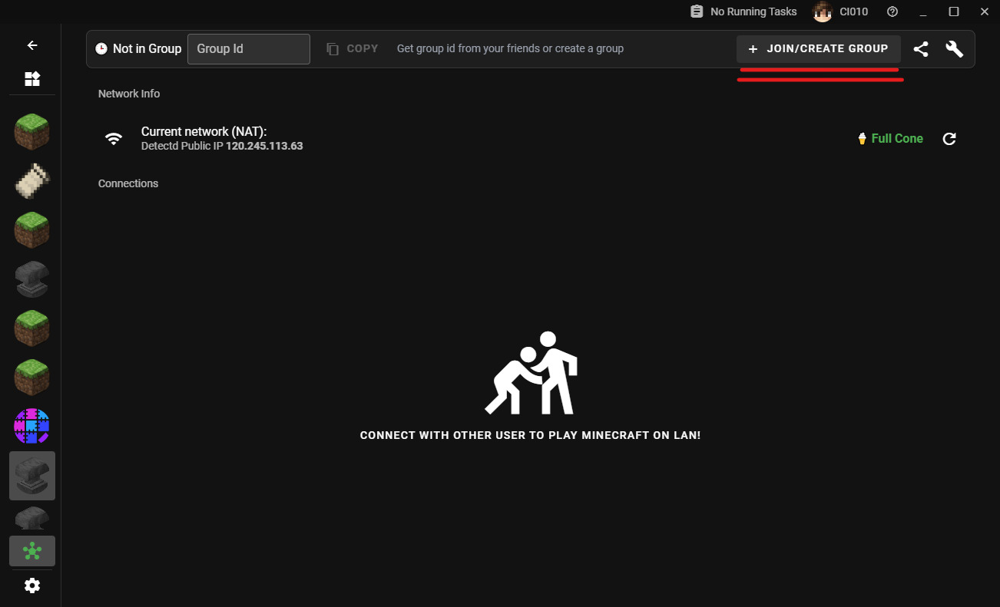
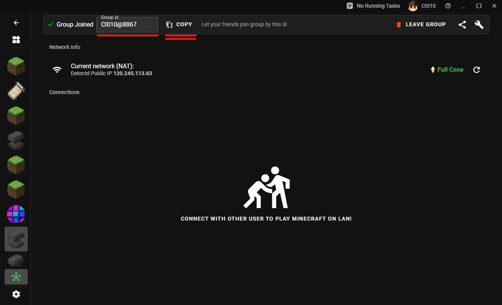

# Guide multijoueur

> Rédaction en cours

## Démarrage rapide

Accédez à la page `Multijoueur sur LAN`.

Cliquez sur le bouton `Rejoindre/Créer un groupe` en haut à droite.

Vous pouvez créer un groupe si votre connexion Internet est bonne. Cliquez sur `Group ID` pour le copier.

Votre pair doit saisir cet "identifiant de groupe" pour rejoindre votre groupe. Une fois qu'il s'est inscrit, vous devriez voir son statut de connexion ci-dessous.

Ensuite, vous devez démarrer le jeu et ouvrir le jeu sur LAN, et votre ami devrait voir votre jeu même si vous n'êtes pas dans le même LAN.

## Comment utiliser les services de transfert

> Rédaction en cours

## Skins hors ligne

> Rédaction en cours