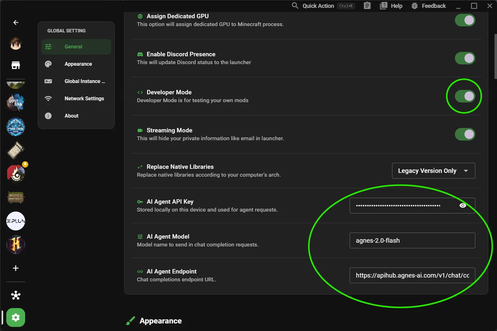

# إعداد Agnes AI

يساعدك هذا الدليل في تكوين وكيل الذكاء الاصطناعي (AI Agent) المدمج في XMCL.

::: tip Agnes AI مجاني
**Agnes AI مجاني تماماً للاستخدام.** ما عليك سوى إنشاء مفتاح API مجاني — لا يتطلب أي دفع أو اشتراك أو بطاقة ائتمان.
:::

بعد إكمال هذه الصفحة، يجب أن تكون قادراً على:

- فتح مربع حوار وكيل الذكاء الاصطناعي؛
- تشخيص سجلات الانهيار (crash logs) باستخدام الوكيل المدمج؛
- تشغيل أدوات الوكيل (تبديل المود، التثبيت، البحث/تعديل الإعدادات، إلخ).

## ما تحتاج إليه

- أحدث إصدار من XMCL.
- اتصال بالإنترنت.
- مفتاح API مجاني لـ Agnes AI.

## الخطوة 1: احصل على مفتاح API لـ Agnes AI

1. افتح بوابة المطورين لـ Agnes AI.
2. أنشئ حساباً أو سجل الدخول إليه.
3. أنشئ مفتاح API.
4. انسخ المفتاح واحفظه بأمان.


## الخطوة 2: افتح إعدادات وكيل XMCL

1. افتح XMCL.
2. انتقل إلى **الإعدادات -> عام** (Settings -> General).
3. قم بتمكين **وضع المطور** (Developer Mode).
4. قم بالتمرير إلى قسم **وكيل الذكاء الاصطناعي** (AI Agent).



## الخطوة 3: ملء حقول الوكيل

في إعدادات **وكيل الذكاء الاصطناعي**:

- **مفتاح API**: الصق مفتاح Agnes الخاص بك.
- **النموذج**: احتفظ بالافتراضي ما لم يُذكر خلاف ذلك.
- **نقطة النهاية** (Endpoint): احتفظ بالافتراضي ما لم يُذكر خلاف ذلك.

نقطة نهاية Agnes الافتراضية:

```text
https://apihub.agnes-ai.com/v1/chat/completions
```


## الخطوة 4: التحقق من عمله

1. اضغط على `Ctrl/Cmd + Shift + A` لفتح مربع حوار الوكيل.
2. أرسل رسالة بسيطة مثل: `list my installed mods`.
3. تأكد من استجابة المساعد دون خطأ في الإعدادات.

## استكشاف الأخطاء وإصلاحها

### الوكيل لا يفتح

- تأكد من تمكين **وضع المطور**.
- أعد تشغيل XMCL مرة واحدة بعد تمكين وضع المطور.

### لا يزال تحذير "غير مهيأ" يظهر

- تحقق مجدداً من مفتاح API (دون مسافات إضافية أو سطور جديدة).
- تأكد من إمكانية الوصول إلى نقطة النهاية من شبكتك.

### فشل الطلب / 401 / 403

- مفتاح API غير صالح أو منتهي الصلاحية أو لا يملك الإذن.
- أعد إنشاء المفتاح في بوابة Agnes والصقه مرة أخرى.

### انتهت مهلة الطلب

- تحقق من جدار الحماية/الوكيل (firewall/proxy).
- حاول مجدداً باستخدام نقطة النهاية الافتراضية.

## ملاحظات الأمان

- عامل مفاتيح API ككلمات مرور.
- لا تشارك لقطات شاشة تحتوي على مفتاحك.
- قم بتغيير المفاتيح إذا كنت تشك في تسريبها.
