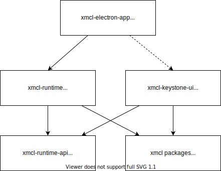

# المساهمة

### التكنولوجيا المستخدمة وخلفية عامة

هنا نظرة عامة على سلسلة الأدوات وبيئة التشغيل لهذا المشروع:

للمشروع بأكمله، لدينا:

- [Node.js >=20](https://nodejs.org/): بيئة عمل المكتبات الأساسية.
- [Electron 29](https://electron.atom.io): بيئة التشغيل الفعلية للانشر.
- [pnpm](https://pnpm.io/): لإدارة الحزم في الـ monorepo.
- [TypeScript](https://www.typescriptlang.org/): يستخدم المشروع لغة TypeScript قدر الإمكان.

للعملية الرئيسية (Electron)، لدينا:

- [esbuild](https://esbuild.github.io/): لبناء ملفات TypeScript الخاصة بالعملية الرئيسية.

لجانب العرض (الواجهة الأمامية البحتة):

- [Vue](https://vuejs.org): لبناء واجهات المستخدم.
- [Vite](https://vitejs.dev/): كمنظومة بناء.
- [Vuetify](https://vuetifyjs.com/): كمكتبة مكونات.
- [Vue Composition API](https://github.com/vuejs/composition-api): جسر لواجهة البرمجة التكوينية لـ Vue 2. بمجرد ترقية Vuetify إلى Vue 3، ستتم ترقية Vue وإزالة هذا المكون.

### هيكل المشروع وتصميمه



راجع [DeepWiki](https://deepwiki.com/Voxelum/x-minecraft-launcher) للحصول على تفاصيل التصميم. يجب أن يغطي 90% من الحالات!

## المساهمة

نوصي بشدة باستخدام VSCode لفتح المشروع.

### البداية

#### الاستنساخ

استنسخ المشروع مع وسيط المودولات الفرعية `--recurse-submodules`:

```bash
git clone --recurse-submodules https://github.com/Voxelum/x-minecraft-launcher
```

إذا نسيت إضافة الوسيط، ستحتاج إلى تهيئة وتحديث المودولات الفرعية للـ git يدوياً:

```bash
git submodule init
git submodule update
```

#### التثبيت

ثبّت المشروع باستخدام [pnpm](https://pnpm.io):

```bash
pnpm install
```

#### تعيين متغيرات البيئة

يجب تعيين الـ `CURSEFORGE_API_KEY` عن طريق إنشاء ملف `.env` تحت مجلد `xmcl-electron-app`. هذا الملف مضاف بالفعل في ملف `.gitignore`.

:::warning تذكر
**لا تقم بتسريب مفتاح CURSEFORGE API الخاص بك**
:::

#### تشغيل اللانشر

ثم يمكنك تشغيل اللانشر.

#### لمستخدمي VSCode

اذهب إلى قسم `Run and Debug` واستخدم ملف التعريف `Electron: Main (launch)` لبدء تشغيل electron. (مفتاح الاختصار F5)

#### لغير مستخدمي VSCode

افتح نافذة ترمينال واحدة:

```bash
# تشغيل خادم التطوير للواجهة الأمامية
npm run dev:renderer
```

افتح نافذة ترمينال أخرى:

```bash
# تشغيل مراقبة كود العملية الرئيسية
npm run dev:main
```

#### تحديث الكود أثناء التشغيل (Hot Change)

عندما تقوم بتعديل الكود وترغب في رؤية التحديثات على نسخة اللانشر قيد التشغيل:

##### لعملية العرض (البصرية)

يوفر Vite إعادة تحميل فورية، ويجب أن تتحدث تلقائياً. إذا حدث خطأ، يمكنك تحديث المتصفح بالضغط على `Ctrl+R`.

##### للعملية الرئيسية

إذا كنت تستخدم VSCode، بعد تغيير الكود، يمكنك النقر فوق زر إعادة التحميل في مصحح أخطاء VSCode.

إذا لم تكن تستخدم VSCode، فسيتم إغلاق Electron وإعادة تحميله تلقائياً.

### العثور على مشكلة في نواة اللانشر

توجد نواة اللانشر في [مشروع منفصل](https://github.com/voxelum/minecraft-launcher-core-node) مكتوب بلغة TypeScript.

يرجى فتح تذكرة (issue) هناك إذا حددت أي مشكلة تتعلق به.

### مصحح أخطاء VSCode

يتضمن المشروع إعدادات مصحح أخطاء VSCode. يمكنك إضافة نقطة توقف (breakpoint) واستكشاف الأخطاء. حالياً، تدعم طريقة تصحيح أخطاء VSCode العملية الرئيسية فقط (يمكنك استخدام Chrome Devtools لعملية العرض).

لدينا خياران الآن:

1. Electron: Main (launch)
2. Electron: Main (attach)

إذا استخدمت الخيار الأول، فسيقوم تلقائياً بربط مصحح الأخطاء بالنسخة قيد التشغيل.

### إرسال الكود (Commit)

يتبع هذا المشروع نظام [التسجيلات التقليدية](https://www.conventionalcommits.org/en/v1.0.0-beta.3/). باختصار، يجب أن يكون السطر الأول من رسالة الإرسال كالتالي:

```text
commit type: commit description
```

هناك عدة أنواع متاحة: `feat` (ميزة جديدة)، `fix` (إصلاح خطأ)، `refactor` (إعادة هيكلة)، `style` (تنسيق)، `docs` (توثيق)، `chore` (مهام دورية)، `test` (اختبارات).

**سيتم رفض تعديلك إذا لم تتبع هذه القواعد.**

### كيفية البناء

يتطلب اللانشر تشغيل أمرين لبنائه:

أولاً، تحتاج إلى بناء كود الواجهة الأمامية:

```bash
pnpm build:renderer
```

ما لم يتم تغيير الكود الموجود تحت `xmcl-keystone-ui` فلا داعي لبنائه مجدداً.

ثم يمكنك بناء حزمة Electron المدمجة مع الواجهة الأمامية التي قمت ببنائها للتو:

```bash
pnpm build
```
