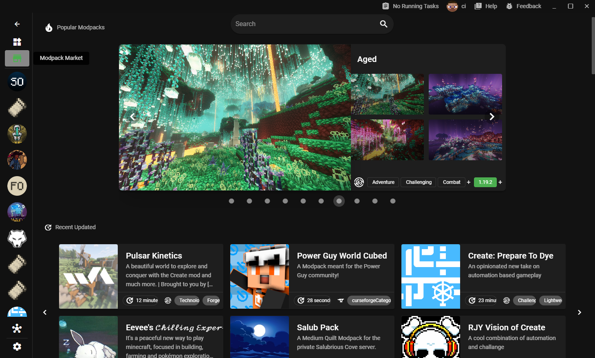
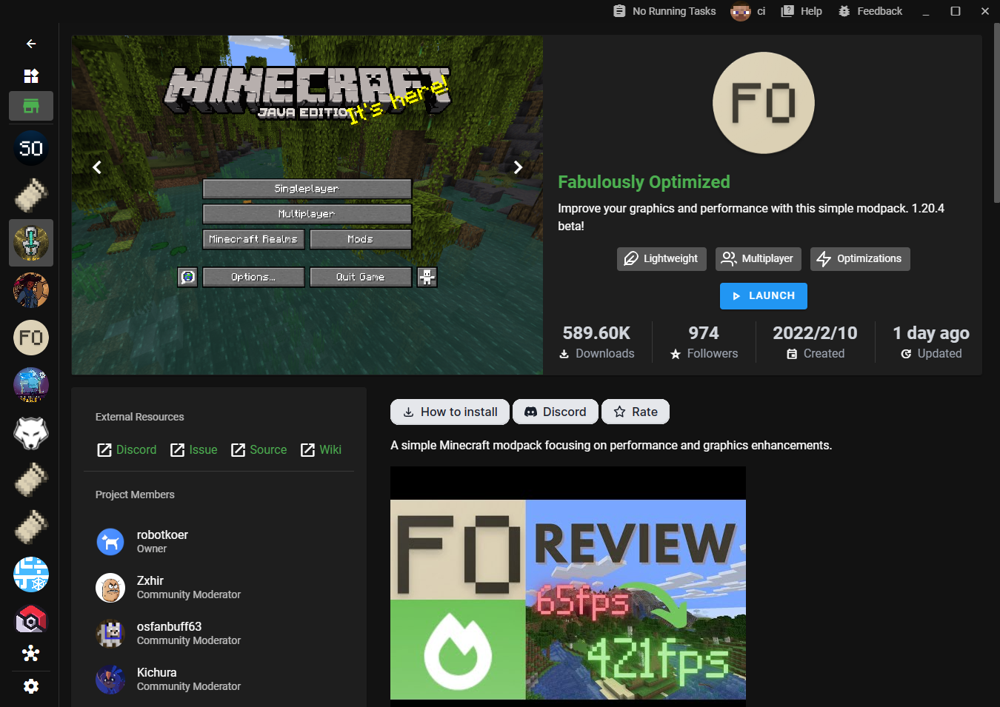

## [0.39.0](#0.39.0)
### 🚀 Features

- [Add new store page for modpacks](#add-new-store-page-for-modpacks) ([0abc2609137a155183a13d7bd7064feaa1d170cf](https://github.com/Voxelum/x-minecraft-launcher/commit/0abc2609137a155183a13d7bd7064feaa1d170cf))
- Support oculus as shader mod ([9b06fca5b5b3c409a6409032cab81a4160dbf3e1](https://github.com/Voxelum/x-minecraft-launcher/commit/9b06fca5b5b3c409a6409032cab81a4160dbf3e1))
- Deutsch ist jetzt verfügbar) (#542) ([25146f91c8deb1b8827e8c9755e0b04f760daaa8](https://github.com/Voxelum/x-minecraft-launcher/commit/25146f91c8deb1b8827e8c9755e0b04f760daaa8))

### 🐛 Bug Fixes & Patches

- Sometime curseforge detail cannot show ([fec80602929338e5b613321bce699e0c2c797192](https://github.com/Voxelum/x-minecraft-launcher/commit/fec80602929338e5b613321bce699e0c2c797192))
- User should be able to abort pre-launch task ([09cd1fd0befc389b0c24a0eb33733e9ae6efcebd](https://github.com/Voxelum/x-minecraft-launcher/commit/09cd1fd0befc389b0c24a0eb33733e9ae6efcebd))
- Should not block instance install due to the modpack failure ([c3d8b5555d811209e8fa385ab485cbfd7b3edb7f](https://github.com/Voxelum/x-minecraft-launcher/commit/c3d8b5555d811209e8fa385ab485cbfd7b3edb7f))
- Try to capture the bad xbox account issue ([4a04c3d618694393e2d16be7d36071ae60b3323c](https://github.com/Voxelum/x-minecraft-launcher/commit/4a04c3d618694393e2d16be7d36071ae60b3323c))

### 🏗️ Refactors

- Adjust news time format ([4363ca010c469ada937205856138fc304054a8a3](https://github.com/Voxelum/x-minecraft-launcher/commit/4363ca010c469ada937205856138fc304054a8a3))
- Track perf of the launch ([3faa99a410c883a0da1a546773eaec9b3db0a997](https://github.com/Voxelum/x-minecraft-launcher/commit/3faa99a410c883a0da1a546773eaec9b3db0a997))
- Remove unpack worker files in new electron ([432c8c545d331fd74c1a9db70773da250e9a134d](https://github.com/Voxelum/x-minecraft-launcher/commit/432c8c545d331fd74c1a9db70773da250e9a134d))
- Handle more errors ([7f0f48852c6b238d2e6831e3e646954dd3aa903b](https://github.com/Voxelum/x-minecraft-launcher/commit/7f0f48852c6b238d2e6831e3e646954dd3aa903b))
- Improve the perf of import ([8d22984583128f82a90427ea604d6a2128a3a2ce](https://github.com/Voxelum/x-minecraft-launcher/commit/8d22984583128f82a90427ea604d6a2128a3a2ce))
- Remove unused i18n keys ([9f8a18ad9b54e7dbeb5aa12f08c9d265073d9abc](https://github.com/Voxelum/x-minecraft-launcher/commit/9f8a18ad9b54e7dbeb5aa12f08c9d265073d9abc))
- Group the local resources ([db2d482eb4df572faf4cdea832315c86b2024a89](https://github.com/Voxelum/x-minecraft-launcher/commit/db2d482eb4df572faf4cdea832315c86b2024a89))
- Use session id as the peer group id ([261623e4a35c9651de42ef0dee24e1a29c5deef1](https://github.com/Voxelum/x-minecraft-launcher/commit/261623e4a35c9651de42ef0dee24e1a29c5deef1))

## Add new store page for modpacks

New features update will focus on adding the unified store page for modpack, making "one click to play" modpack experience 

Not installed yet modpack will show install button. Clicking install will directly download and create an instance for it (without dialog) 

installed modpack will show play button, which will redirect you to the related instance page. 

The final experience/logic of installing/playing modpack should be similar to the installing/playing games in Steam.
