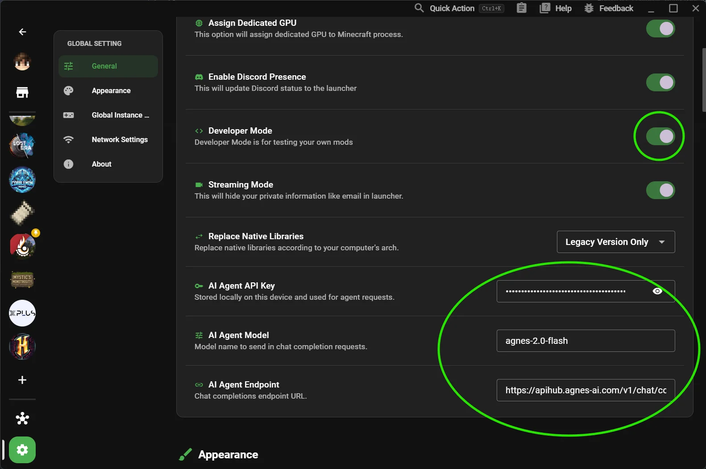
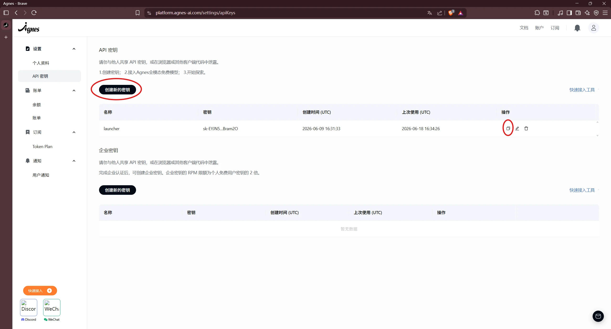

# AI Agent Setup

This guide walks you through configuring the built-in **AI Agent** in XMCL.

Because XMCL supports the universal **OpenAI-compatible API standard** (`/v1/chat/completions`), you can use the default free **Agnes AI** service or connect any other state-of-the-art AI provider: **DeepSeek**, **OpenAI (ChatGPT)**, **Claude (via OpenRouter)**, **Google Gemini**, **Groq**, or even **offline local models via Ollama and LM Studio**.

---

## What the XMCL AI Agent Can Do

Once connected, your built-in AI assistant can:

- 🔍 **Analyze Crash Logs**: Instantly diagnose crash traces, incompatible mod combinations, or missing libraries.
- ⚙️ **Manage Mods via Chat**: Enable, disable, update, or find mods directly through natural language.
- 🛠️ **Edit Config Files**: Assist with modifying and troubleshooting complex modpack configuration files.
- 💡 **Game Assistance**: Answer questions about modpack mechanics, modloader compatibilities (Forge/Fabric/NeoForge/Quilt), and server configurations.

---

## Step 1: Enable AI Agent Settings in XMCL

1. Open **XMCL**.
2. Navigate to **Settings -> General**.
3. Toggle on **Developer Mode**.
4. Scroll down to the **AI Agent** configuration card.



---

## Option 1: Free Agnes AI (Default)

::: tip Agnes AI is Free
**Agnes AI** is built specifically for the XMCL ecosystem and is **completely free to use**. It only requires creating a free API key — no credit card, subscription, or billing details required.
:::

1. Open the **Agnes AI** developer console.
2. Sign in or create a free account.
3. Click **Create API Key** and copy your generated key.
4. In XMCL's **AI Agent** settings, enter:
   - **API Key**: your Agnes API key.
   - **Endpoint**: `https://apihub.agnes-ai.com/v1/chat/completions`
   - **Model**: leave default or use the suggested model.



---

## Option 2: Connecting Custom AI Models & Providers

If you prefer using your own API keys or running private local LLMs on your machine, simply provide the corresponding **Endpoint**, **Model**, and **API Key**:

### Popular Provider Configurations

#### 1. DeepSeek (DeepSeek-V3 & DeepSeek-R1)
High-precision code and crash log reasoning at affordable pricing:
- **Endpoint**: `https://api.deepseek.com/v1/chat/completions`
- **Model**: `deepseek-chat` *(fast responses)* or `deepseek-reasoner` *(R1 deep reasoning)*
- **API Key**: Available at [platform.deepseek.com](https://platform.deepseek.com/)

#### 2. OpenAI (GPT-4o & GPT-4o-mini)
- **Endpoint**: `https://api.openai.com/v1/chat/completions`
- **Model**: `gpt-4o-mini` *(fast and cost-effective)* or `gpt-4o`
- **API Key**: Available at [platform.openai.com](https://platform.openai.com/)

#### 3. Groq (Ultra-Fast LPU Inference)
- **Endpoint**: `https://api.groq.com/openai/v1/chat/completions`
- **Model**: `llama-3.3-70b-versatile` or `llama-3.1-8b-instant`
- **API Key**: Available at [console.groq.com](https://console.groq.com/)

#### 4. OpenRouter (Claude 3.5 Sonnet / Gemini / Llama)
Access models from Anthropic, Google, and Meta with a single balance:
- **Endpoint**: `https://openrouter.ai/api/v1/chat/completions`
- **Model**: `anthropic/claude-3.5-sonnet` or `meta-llama/llama-3.3-70b-instruct`
- **API Key**: Available at [openrouter.ai](https://openrouter.ai/)

#### 5. Google Gemini (OpenAI-Compatible Endpoint)
- **Endpoint**: `https://generativelanguage.googleapis.com/v1beta/openai/chat/completions`
- **Model**: `gemini-2.0-flash` or `gemini-1.5-flash`
- **API Key**: Available at [aistudio.google.com](https://aistudio.google.com/)

#### 6. Offline Local AI (Ollama / LM Studio)
100% private execution without internet access:

##### Via Ollama:
1. Install [Ollama](https://ollama.com/) and run your model in terminal: `ollama run qwen2.5-coder` (or `llama3.2`).
2. In XMCL settings, enter:
   - **Endpoint**: `http://localhost:11434/v1/chat/completions`
   - **Model**: `qwen2.5-coder` *(or your model name)*
   - **API Key**: `ollama` *(any text)*

::: tip CORS Note for Ollama
If XMCL fails to connect to Ollama, ensure Ollama permits local CORS requests by setting `OLLAMA_ORIGINS="*"` before starting the service.
:::

##### Via LM Studio:
- **Endpoint**: `http://localhost:1234/v1/chat/completions`
- **Model**: loaded model identifier in the Local Server tab
- **API Key**: `lm-studio` *(any text)*

---

---

## Step 3: Hotkey & Verification

1. Press <kbd>Ctrl</kbd> + <kbd>Shift</kbd> + <kbd>A</kbd> (or <kbd>Cmd</kbd> + <kbd>Shift</kbd> + <kbd>A</kbd> on macOS) to open the **AI Agent** window.
2. Send a test prompt, for example:
   ```text
   List my installed mods and check for any potential conflicts.
   ```
3. Confirm the assistant responds and interacts with your instance context properly.

---

## Troubleshooting

### ❌ Agent Dialog Does Not Open
- Ensure **Developer Mode** is turned on in **Settings -> General**.
- Restart XMCL once after toggling Developer Mode.

### ❌ 401 Unauthorized / 403 Forbidden
- Ensure no accidental trailing spaces or line breaks were copied with your API key.
- Verify your provider account has active credits or remaining free quota.

### ❌ Connection Timeout / Network Error
- Double-check that your **Endpoint** URL is correct and ends with `/chat/completions` or the valid base URL.
- For local tools like Ollama or LM Studio, ensure the application is running in the background.

---

## Security Best Practices

- Keep your API keys confidential and treat them like passwords.
- Never share screenshots showing your unmasked API keys.
- Rotate or revoke keys immediately if you suspect they have been compromised.
