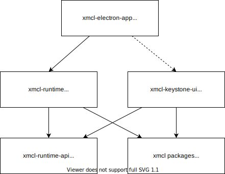

# Үлес қосу
### Технологиялық стек пен жоба туралы

Мұнда біз осы жобаның құралдар тізбегі мен орындалу ортасына шолу жасаймыз

Бүкіл жоба үшін бізде бар:

- [Node.js >=20](https://nodejs.org/). Негізгі кітапханалардың базалық ортасы.
- [Electron 29](https://electron.atom.io). Лаунчердің нақты орындалу ортасы.
- [pnpm](https://pnpm.io/). Monorepo пакеттерін басқару үшін қолданылады.
- [TypeScript](https://www.typescriptlang.org/). Бүкіл жобада мүмкіндігінше TypeScript қолданылады.

Негізгі процесс үшін (Electron), біз келесіні қолданамыз:

- [esbuild](https://esbuild.github.io/). Негізгі процесс TypeScript-ін құрастыру үшін esbuild қолданамыз.

Рендерер жағында, яғни таза фронтенд:

- [Vue](https://vuejs.org). Пайдаланушы интерфейстерін құру үшін қолданылады.
- [Vite](https://vitejs.dev/). Құрастыру жүйесі ретінде қолданылады.
- [Vuetify](https://vuetifyjs.com/). Компонент кітапханасы ретінде қолданылады.
- [Vue Composition API](https://github.com/vuejs/composition-api). Vue 2 үшін композициялық API көпірі. Vuetify Vue 3-ке жаңартылған кезде, Vue де жаңартылады және бұл жойылады.

### Жоба құрылымы мен дизайны



Толық дизайн туралы [](https://deepwiki.com/Voxelum/x-minecraft-launcher) қараңыз. Бұл жағдайлардың 90%-ын қамтуы керек!

## Үлес қосу

Жобаны ашу үшін VSCode қолдануды қатты ұсынамыз.

### Бастау

#### Клондау

Жобаны `--recurse-submodules` флагымен клондаңыз.

```bash
git clone --recurse-submodules https://github.com/Voxelum/x-minecraft-launcher
```

Егер сіз `--recurse-submodules` флагын қосуды ұмытып кетсеңіз, git субмодульді қолмен инициализациялап, жаңартуыңыз керек.

```bash
git submodule init
git submodule update
```

#### Орнату

Жобаны [pnpm](https://pnpm.io) көмегімен орнатыңыз:

```
pnpm install
```

<details>
  <summary> Қытайда тәуелділіктерді (мысалы, Electron) баяу орнату мәселесінің шешімі </summary>

  Git bash терезеңізді ашып, `pnpm i` алдында `registry=https://registry.npm.taobao.org electron_mirror="https://npm.taobao.org/mirrors/electron/"` қосыңыз. Alibaba ұсынған Қытай npm және Electron айнасын қолданыңыз.

  Соңғы команда:

  ```bash
  registry=https://registry.npm.taobao.org electron_mirror="https://npm.taobao.org/mirrors/electron/" pnpm i
  ```
</details>

#### Орта айнымалыларын орнату

`xmcl-electron-app` ішінде `.env` файлын жасау арқылы `CURSEFORGE_API_KEY` орнатуыңыз керек. Бұл `.env` файлы `.gitignore` файлына қосылған.

:::warning ЕСТЕ САҚТАҢЫЗ
**CURSEFORGE API KEY КІЛТІҢІЗДІ ЖАРИЯЛАМАҢЫЗ**
:::

#### Лаунчерді бастау

Сонда сіз лаунчерді іске қоса аласыз

#### VSCode үшін

`Run and Debug` бөліміне өтіп, электронды бастау үшін `Electron: Main (launch)` профилін қолданыңыз. (F5 пернесі)

#### VSCode емес редакторлар үшін

Бір терминалды ашыңыз

```bash
# UI үшін dev серверін бастау
npm run dev:renderer
```

Басқа терминалды ашыңыз

``` bash
# Негізгі процесс кодын бақылауды бастау
npm run dev:main
```
