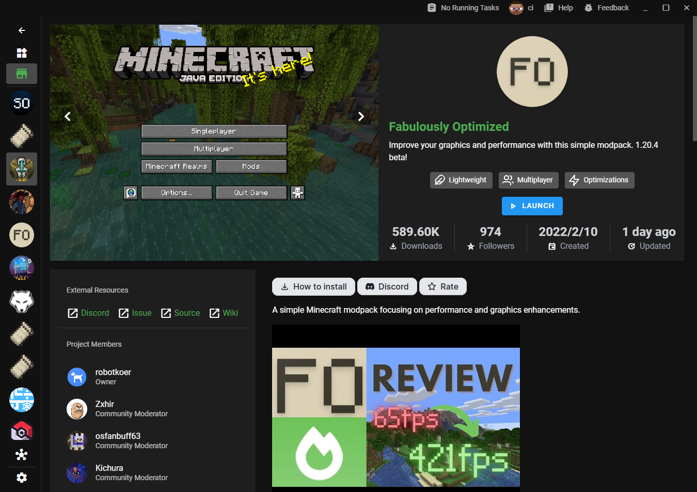

## [0.39.0](#0.39.0)

### 🚀 기능 추가

- 모드팩용 새로운 스토어 페이지를 추가했어요 ([0abc2609137a155183a13d7bd7064feaa1d170cf](https://github.com/Voxelum/x-minecraft-launcher/commit/0abc2609137a155183a13d7bd7064feaa1d170cf))
- 셰이더 모드로 Oculus를 지원했어요 ([9b06fca5b5b3c409a6409032cab81a4160dbf3e1](https://github.com/Voxelum/x-minecraft-launcher/commit/9b06fca5b5b3c409a6409032cab81a4160dbf3e1))
- 독일어를 지원하도록 추가했어요 (#542) ([25146f91c8deb1b8827e8c9755e0b04f760daaa8](https://github.com/Voxelum/x-minecraft-launcher/commit/25146f91c8deb1b8827e8c9755e0b04f760daaa8))

### 🐛 버그 수정 및 패치

- CurseForge 상세 정보가 일부 상황에서 표시되지 않던 문제를 수정했어요 ([fec80602929338e5b613321bce699e0c2c797192](https://github.com/Voxelum/x-minecraft-launcher/commit/fec80602929338e5b613321bce699e0c2c797192))
- 사용자가 사전 실행(pre-launch) 작업을 중단할 수 있도록 수정했어요 ([09cd1fd0befc389b0c24a0eb33733e9ae6efcebd](https://github.com/Voxelum/x-minecraft-launcher/commit/09cd1fd0befc389b0c24a0eb33733e9ae6efcebd))
- 모드팩 실패로 인해 인스턴스 설치가 막히지 않도록 수정했어요 ([c3d8b5555d811209e8fa385ab485cbfd7b3edb7f](https://github.com/Voxelum/x-minecraft-launcher/commit/c3d8b5555d811209e8fa385ab485cbfd7b3edb7f))
- Xbox 계정 관련 오류를 잡도록 시도했어요 ([4a04c3d618694393e2d16be7d36071ae60b3323c](https://github.com/Voxelum/x-minecraft-launcher/commit/4a04c3d618694393e2d16be7d36071ae60b3323c))

### 🏗️ 리팩토링

- 뉴스 시간 표시 형식을 조정했어요 ([4363ca010c469ada937205856138fc304054a8a3](https://github.com/Voxelum/x-minecraft-launcher/commit/4363ca010c469ada937205856138fc304054a8a3))
- 실행 성능을 추적하도록 개선했어요 ([3faa99a410c883a0da1a546773eaec9b3db0a997](https://github.com/Voxelum/x-minecraft-launcher/commit/3faa99a410c883a0da1a546773eaec9b3db0a997))
- 새로운 Electron에서 unpack worker 파일을 제거했어요 ([432c8c545d331fd74c1a9db70773da250e9a134d](https://github.com/Voxelum/x-minecraft-launcher/commit/432c8c545d331fd74c1a9db70773da250e9a134d))
- 오류 처리를 더욱 강화했어요 ([7f0f48852c6b238d2e6831e3e646954dd3aa903b](https://github.com/Voxelum/x-minecraft-launcher/commit/7f0f48852c6b238d2e6831e3e646954dd3aa903b))
- 가져오기(import) 성능을 개선했어요 ([8d22984583128f82a90427ea604d6a2128a3a2ce](https://github.com/Voxelum/x-minecraft-launcher/commit/8d22984583128f82a90427ea604d6a2128a3a2ce))
- 사용하지 않는 i18n 키를 제거했어요 ([9f8a18ad9b54e7dbeb5aa12f08c9d265073d9abc](https://github.com/Voxelum/x-minecraft-launcher/commit/9f8a18ad9b54e7dbeb5aa12f08c9d265073d9abc))
- 로컬 리소스를 그룹화했어요 ([db2d482eb4df572faf4cdea832315c86b2024a89](https://github.com/Voxelum/x-minecraft-launcher/commit/db2d482eb4df572faf4cdea832315c86b2024a89))
- 세션 ID를 피어 그룹 ID로 사용하도록 변경했어요 ([261623e4a35c9651de42ef0dee24e1a29c5deef1](https://github.com/Voxelum/x-minecraft-launcher/commit/261623e4a35c9651de42ef0dee24e1a29c5deef1))

## 모드팩 스토어 페이지

새로운 업데이트에서는 통합 모드팩 스토어 페이지를 추가하여 "원클릭 플레이" 모드팩 경험을 제공했어요.

- 설치되지 않은 모드팩은 설치 버튼이 표시되며, 클릭 시 다이얼로그 없이 바로 다운로드 및 인스턴스를 생성해요.  

- 설치된 모드팩은 플레이 버튼이 표시되며, 관련 인스턴스 페이지로 이동해요.  

이 경험/논리는 Steam에서 게임을 설치하고 플레이하는 방식과 유사하게 구성했어요.
