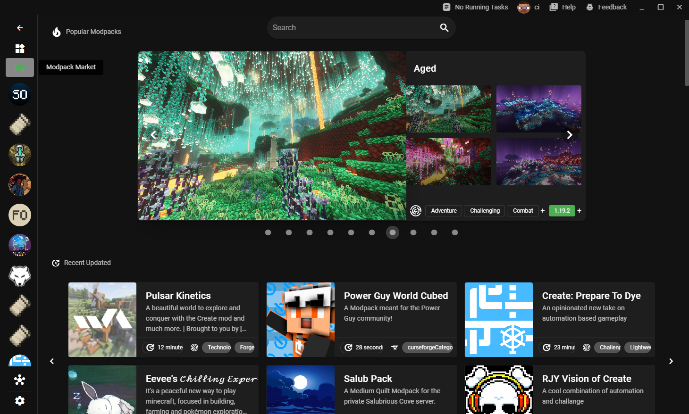

## [0.39.17](#0.39.17)
### 🐛 Bug Fixes & Patches

- Neoforge installation ([9166609b0719285ed8cf6eca392e894c7245d8d1](https://github.com/Voxelum/x-minecraft-launcher/commit/9166609b0719285ed8cf6eca392e894c7245d8d1))
- Should fail to install instance in some corner case ([d2690d50e7a22e6a2d50fa0b4fc059e79e9af4ff](https://github.com/Voxelum/x-minecraft-launcher/commit/d2690d50e7a22e6a2d50fa0b4fc059e79e9af4ff))
- Prevent duplicate hint for modpack import ([a0c1909b4471a799fcc9c3dcca3a506b45e9a2f0](https://github.com/Voxelum/x-minecraft-launcher/commit/a0c1909b4471a799fcc9c3dcca3a506b45e9a2f0))
- Handle the migrate no permission case ([c3011a3d148c7f766cdd2744dc27a169021d7a8f](https://github.com/Voxelum/x-minecraft-launcher/commit/c3011a3d148c7f766cdd2744dc27a169021d7a8f))
### 🏗️ Refactors

- Remove the modpack added hint ([a281dc4f6b485b7188f00528d4db429eee59d22d](https://github.com/Voxelum/x-minecraft-launcher/commit/a281dc4f6b485b7188f00528d4db429eee59d22d))
- FTB should treated as common modpack ([c320fa2bf40dc08c4e141bb3db2018b3986a2aeb](https://github.com/Voxelum/x-minecraft-launcher/commit/c320fa2bf40dc08c4e141bb3db2018b3986a2aeb))

## [0.39.16](#0.39.16)
### 🐛 Bug Fixes & Patches

- Fix arm64 builds

## [0.39.15](#0.39.15)
### 🐛 Bug Fixes & Patches

- Should install and launch 1.4.7 forge ([ec324bee9254061525f214589a5526a616d09dc6](https://github.com/Voxelum/x-minecraft-launcher/commit/ec324bee9254061525f214589a5526a616d09dc6))
- Some curseforge modpack cannot be installed ([ce3ecb6df52f12a5a4728baf5afc7ad088305921](https://github.com/Voxelum/x-minecraft-launcher/commit/ce3ecb6df52f12a5a4728baf5afc7ad088305921))
- Launch server instance ([388465a94681110dd267177d263a4673c373fc82](https://github.com/Voxelum/x-minecraft-launcher/commit/388465a94681110dd267177d263a4673c373fc82))
- Adjust the offline user id to support offline mode skin ([3078af482dcf63b53d6141928e2f1c79890e1811](https://github.com/Voxelum/x-minecraft-launcher/commit/3078af482dcf63b53d6141928e2f1c79890e1811))
### 🏗️ Refactors

- Keep original dns after override ([e90ebd8630db377f8cba975d22f4d3f62faa4523](https://github.com/Voxelum/x-minecraft-launcher/commit/e90ebd8630db377f8cba975d22f4d3f62faa4523))
- Include original dns servers for the dns override ([178f4fc08e41a3db4f5e37a82b97867a8addb3e2](https://github.com/Voxelum/x-minecraft-launcher/commit/178f4fc08e41a3db4f5e37a82b97867a8addb3e2))

## [0.39.14](#0.39.14)
### 🐛 Bug Fixes & Patches

- Adjust search logic to avoid the limit is negative ([2a3d706973bde04a85e0b40871d4a1bb617edb93](https://github.com/Voxelum/x-minecraft-launcher/commit/2a3d706973bde04a85e0b40871d4a1bb617edb93))

## [0.39.13](#0.39.13)
### 🐛 Bug Fixes & Patches

- Large file sometime cannot be downloaded ([fc3bb740ce4e1da45a008451bf0ccea9a3d5d105](https://github.com/Voxelum/x-minecraft-launcher/commit/fc3bb740ce4e1da45a008451bf0ccea9a3d5d105))
- Should not pop notification for installed modpack ([c2683ad4c015627f8365a16c0c2360697becf348](https://github.com/Voxelum/x-minecraft-launcher/commit/c2683ad4c015627f8365a16c0c2360697becf348))
- Detect the database not opened issue and hint user ([bc1c1b098725fd32b1059fdcda6287dadc49f9f8](https://github.com/Voxelum/x-minecraft-launcher/commit/bc1c1b098725fd32b1059fdcda6287dadc49f9f8))
- When mod is busy to parse, wait and retry ([95f71bda1c7d6b239357f7fe4d4878bb90b8cc07](https://github.com/Voxelum/x-minecraft-launcher/commit/95f71bda1c7d6b239357f7fe4d4878bb90b8cc07))
- Optfine cannot be searched ([76ad54947854543f03a3308b819028bbefb29424](https://github.com/Voxelum/x-minecraft-launcher/commit/76ad54947854543f03a3308b819028bbefb29424))

## [0.39.12](#0.39.12)
### 🐛 Bug Fixes & Patches

- Avoid EMFILE error when too many files opened ([90da9e0cfba91d52b2077f7e32e24dfe47115932](https://github.com/Voxelum/x-minecraft-launcher/commit/90da9e0cfba91d52b2077f7e32e24dfe47115932))

## [0.39.11](#0.39.11)
### 🐛 Bug Fixes & Patches

- Revalidate the state once focus to make sure mods list up-to-date ([7c50bca9c124ac101fc93c717bcc7ea5a8313aad](https://github.com/Voxelum/x-minecraft-launcher/commit/7c50bca9c124ac101fc93c717bcc7ea5a8313aad))
- Prevent cannot save instance in some cases ([eb81a8cef55a43ea8da1bff78094360c2117e907](https://github.com/Voxelum/x-minecraft-launcher/commit/eb81a8cef55a43ea8da1bff78094360c2117e907))
- Cannot migrate the data folder ([d389d3ede66cc66da5642c874d47e502b9db2a2f](https://github.com/Voxelum/x-minecraft-launcher/commit/d389d3ede66cc66da5642c874d47e502b9db2a2f))
### 🏗️ Refactors

- Close add instance dialog right after the instance is created ([e772fe5b2867e1e59b32bc69f49cc9d08d367ef5](https://github.com/Voxelum/x-minecraft-launcher/commit/e772fe5b2867e1e59b32bc69f49cc9d08d367ef5))
- Decorate more error ([9e977bfe07b261e90378b87fd18f4cb38ca669a0](https://github.com/Voxelum/x-minecraft-launcher/commit/9e977bfe07b261e90378b87fd18f4cb38ca669a0))

## [0.39.10](#0.39.10)
### 🐛 Bug Fixes & Patches

- Sometime the natives won't be decompressed ([542f8c256077c3310e3b2835b608924657098069](https://github.com/Voxelum/x-minecraft-launcher/commit/542f8c256077c3310e3b2835b608924657098069))

## [0.39.9](#0.39.9)
### 🐛 Bug Fixes & Patches

- Fix minecraft pre-release filtering ([dfd12178a389885cfd9282cb04cbced561dff074](https://github.com/Voxelum/x-minecraft-launcher/commit/dfd12178a389885cfd9282cb04cbced561dff074))
- Correctly hint user to switch java if spawn process with ENOEN ([d591ee98d332794009d978c976153fac369e912e](https://github.com/Voxelum/x-minecraft-launcher/commit/d591ee98d332794009d978c976153fac369e912e))
- Adjust the getJson fail condition to bypass some potiential correct result ([1f1d65f2ec018d702f4e6c101db0385a549b79ef](https://github.com/Voxelum/x-minecraft-launcher/commit/1f1d65f2ec018d702f4e6c101db0385a549b79ef))
### 🏗️ Refactors

- Move the modrinth code into composable ([48a6264a38939f7748863d23787bc7e4d904a138](https://github.com/Voxelum/x-minecraft-launcher/commit/48a6264a38939f7748863d23787bc7e4d904a138))
- Capture set remote sdp error ([49f7c35d0481f5f2d41beb644be73733f65e88ba](https://github.com/Voxelum/x-minecraft-launcher/commit/49f7c35d0481f5f2d41beb644be73733f65e88ba))
- Auto assign dns if lookup failed ([f74837f447c0e78229a1c1c327e72634ef459533](https://github.com/Voxelum/x-minecraft-launcher/commit/f74837f447c0e78229a1c1c327e72634ef459533))

## [0.39.8](#0.39.8)
### 🐛 Bug Fixes & Patches

- Revalidate instance files before launch ([61f891514fa807ac0702e858c85198b68ee06f92](https://github.com/Voxelum/x-minecraft-launcher/commit/61f891514fa807ac0702e858c85198b68ee06f92))
- Improve the install fail success rate by adjusting retry policy ([81e9a6da9c5e1720e1212399a3288b59e515f7bb](https://github.com/Voxelum/x-minecraft-launcher/commit/81e9a6da9c5e1720e1212399a3288b59e515f7bb))
- Handle more user exception ([9131ece20491df4495256d610532888a73bc14dd](https://github.com/Voxelum/x-minecraft-launcher/commit/9131ece20491df4495256d610532888a73bc14dd))
- Correctly handle the fail to spawn process error ([b03492d694f7a728573ef27b779ca788a78c68d8](https://github.com/Voxelum/x-minecraft-launcher/commit/b03492d694f7a728573ef27b779ca788a78c68d8))
- Correctly edit iris shader options ([69cd0c0b91909a6be951c263baf954118a185d52](https://github.com/Voxelum/x-minecraft-launcher/commit/69cd0c0b91909a6be951c263baf954118a185d52))
- Should hint user to install version if the version json is actually missing ([99a255a9271062ac556ba83a3f78483bee963465](https://github.com/Voxelum/x-minecraft-launcher/commit/99a255a9271062ac556ba83a3f78483bee963465))
### 🏗️ Refactors

- Correctly handle error for version list to prevent wrong version ([d41acd5a384453c6bd4c6431b3396aa8695a07f9](https://github.com/Voxelum/x-minecraft-launcher/commit/d41acd5a384453c6bd4c6431b3396aa8695a07f9))
- Avoid unnecessary error when linking resource packs ([03462d16dcda964148575f0839f1876144fe3717](https://github.com/Voxelum/x-minecraft-launcher/commit/03462d16dcda964148575f0839f1876144fe3717))
- Correctly handle the non-json response ([af58c158789398a5f96b889ed3d4c9152857c3e3](https://github.com/Voxelum/x-minecraft-launcher/commit/af58c158789398a5f96b889ed3d4c9152857c3e3))
- **telemetry**: Track launch e2e ([7377f8aed6bbd5a1ba4807ba9a8fa85d41fdefcf](https://github.com/Voxelum/x-minecraft-launcher/commit/7377f8aed6bbd5a1ba4807ba9a8fa85d41fdefcf))

## [0.39.7](#0.39.7)
### 🐛 Bug Fixes & Patches

- Correctly handle mod update event ([a5d1e75ad71c0e1b82826a2a5301212f8de4300f](https://github.com/Voxelum/x-minecraft-launcher/commit/a5d1e75ad71c0e1b82826a2a5301212f8de4300f))

## [0.39.6](#0.39.6)
### 🐛 Bug Fixes & Patches

- Forge cannot be installed in some versions ([d9ba40fc119aeb7bcaffcf84e689f817fd123321](https://github.com/Voxelum/x-minecraft-launcher/commit/d9ba40fc119aeb7bcaffcf84e689f817fd123321))
- Fix EMFILE: too many open files error ([3eae207e12276418a14702c009dbcd5f4b513724](https://github.com/Voxelum/x-minecraft-launcher/commit/3eae207e12276418a14702c009dbcd5f4b513724))

## [0.39.5](#0.39.5)
### 🐛 Bug Fixes & Patches

- Check if file is a folder before install as resourcepack ([f55438c65be388a08a0238e2f583c3aa041ea440](https://github.com/Voxelum/x-minecraft-launcher/commit/f55438c65be388a08a0238e2f583c3aa041ea440))
- Just installed mods show in search result ([f7ea12443afbad07a9dafa26753713a6df1ad42d](https://github.com/Voxelum/x-minecraft-launcher/commit/f7ea12443afbad07a9dafa26753713a6df1ad42d))
- Should correctly install curseforge resources ([b37572dc7b2532451ede765cdca6a16e406a6896](https://github.com/Voxelum/x-minecraft-launcher/commit/b37572dc7b2532451ede765cdca6a16e406a6896))
- Should correctly revalidate the mods ([a8b2e462c16fceaa75c6308090fd318f7f301322](https://github.com/Voxelum/x-minecraft-launcher/commit/a8b2e462c16fceaa75c6308090fd318f7f301322))

## [0.39.4](#0.39.4)
### 🐛 Bug Fixes & Patches

- Cover some cases resource packs are added to mods ([1564c92ccd052330535dd15726b801f1e626db75](https://github.com/Voxelum/x-minecraft-launcher/commit/1564c92ccd052330535dd15726b801f1e626db75))
- Should check resource before update mod ([8ad5fe1f29d3b45d0cc8b332f699dd517705c935](https://github.com/Voxelum/x-minecraft-launcher/commit/8ad5fe1f29d3b45d0cc8b332f699dd517705c935))
- Cannot install 1.20.4 forge ([83ebb0cc9ba05cbdbeb6323228eb6290fe06346e](https://github.com/Voxelum/x-minecraft-launcher/commit/83ebb0cc9ba05cbdbeb6323228eb6290fe06346e))
- Group uncaught exception ([5dd80c539be85508291e6b6d38165f38eb70a904](https://github.com/Voxelum/x-minecraft-launcher/commit/5dd80c539be85508291e6b6d38165f38eb70a904))
### 🏗️ Refactors

- Allow clear finished task ([a0ee481c35541ccd8dc961542d74612ec5a45fef](https://github.com/Voxelum/x-minecraft-launcher/commit/a0ee481c35541ccd8dc961542d74612ec5a45fef))
- Add shuffle option for screenshots ([833505ad7b1e6848d9e2eff1b97893c14b186d2f](https://github.com/Voxelum/x-minecraft-launcher/commit/833505ad7b1e6848d9e2eff1b97893c14b186d2f))

## [0.39.3](#0.39.3)
### 🐛 Bug Fixes & Patches

- Should not re-scan the mods if the instance mounted ([f02634b76d4ef2723b9c839cf051f4fe24cbe5a0](https://github.com/Voxelum/x-minecraft-launcher/commit/f02634b76d4ef2723b9c839cf051f4fe24cbe5a0))
- Instances templates aren't shown sometime ([ec31151c21e1fe76ad7319589cb446f1ccabb07c](https://github.com/Voxelum/x-minecraft-launcher/commit/ec31151c21e1fe76ad7319589cb446f1ccabb07c))
- Correctly log aggregated errors ([a5bfed62848117d84499206b7911fd6df7f2ffb6](https://github.com/Voxelum/x-minecraft-launcher/commit/a5bfed62848117d84499206b7911fd6df7f2ffb6))
- Handle some install failures making the modpack install process more fluent ([6a50b52e49ce86b02598c6f1c2a3af25cdd79fd8](https://github.com/Voxelum/x-minecraft-launcher/commit/6a50b52e49ce86b02598c6f1c2a3af25cdd79fd8))

## [0.39.2](#0.39.2)
### 🐛 Bug Fixes & Patches

- Some context menu does not show ([a3211bd778369a7df92e558bd72ad6d04987b71b](https://github.com/Voxelum/x-minecraft-launcher/commit/a3211bd778369a7df92e558bd72ad6d04987b71b))
- Try to prevent the fetching curseforge failed ([512ee8cebf077c94d22ccde2cbaba5e76e719c0d](https://github.com/Voxelum/x-minecraft-launcher/commit/512ee8cebf077c94d22ccde2cbaba5e76e719c0d))
- Should not mount to the unexisted instances ([763c837eba98c74a9d1c11f5ea28071ce57ba52e](https://github.com/Voxelum/x-minecraft-launcher/commit/763c837eba98c74a9d1c11f5ea28071ce57ba52e))
- Should not scan mods folder as mod ([ddbf1319e82dce5634024be7dc216bb977865fab](https://github.com/Voxelum/x-minecraft-launcher/commit/ddbf1319e82dce5634024be7dc216bb977865fab))
- Correctly select file to download for modrinth ([bacc8a3f79602dd615ead26a14a4fa69055c92a3](https://github.com/Voxelum/x-minecraft-launcher/commit/bacc8a3f79602dd615ead26a14a4fa69055c92a3))
### 🏗️ Refactors

- Adjust some ux of export and drop dialog ([90e97b8854e0d731285e59943310ffd07e2f12b4](https://github.com/Voxelum/x-minecraft-launcher/commit/90e97b8854e0d731285e59943310ffd07e2f12b4))

## [0.39.1](#0.39.1)
### 🐛 Bug Fixes & Patches

- Set timeout for refreshing user before launch & track more detail launch phase ([e459dfdb17827d55a6b9a9d4b2195ab43c9890bc](https://github.com/Voxelum/x-minecraft-launcher/commit/e459dfdb17827d55a6b9a9d4b2195ab43c9890bc))
- Should correctly decorate instance file ([1887872a8cdb10c1de469384a8dd7da4abcdb4a0](https://github.com/Voxelum/x-minecraft-launcher/commit/1887872a8cdb10c1de469384a8dd7da4abcdb4a0))
- Should reset selected version if runrime change ([4680f2d277c93b27fdfb3259dafcdc9010f1221b](https://github.com/Voxelum/x-minecraft-launcher/commit/4680f2d277c93b27fdfb3259dafcdc9010f1221b))

## [0.39.0](#0.39.0)

### 🚀 기능 추가

- 모드팩용 새로운 스토어 페이지를 추가했어요 ([0abc2609137a155183a13d7bd7064feaa1d170cf](https://github.com/Voxelum/x-minecraft-launcher/commit/0abc2609137a155183a13d7bd7064feaa1d170cf))
- 셰이더 모드로 Oculus를 지원했어요 ([9b06fca5b5b3c409a6409032cab81a4160dbf3e1](https://github.com/Voxelum/x-minecraft-launcher/commit/9b06fca5b5b3c409a6409032cab81a4160dbf3e1))
- 독일어를 지원하도록 추가했어요 (#542) ([25146f91c8deb1b8827e8c9755e0b04f760daaa8](https://github.com/Voxelum/x-minecraft-launcher/commit/25146f91c8deb1b8827e8c9755e0b04f760daaa8))

### 🐛 버그 수정 및 패치

- CurseForge 상세 정보가 일부 상황에서 표시되지 않던 문제를 수정했어요 ([fec80602929338e5b613321bce699e0c2c797192](https://github.com/Voxelum/x-minecraft-launcher/commit/fec80602929338e5b613321bce699e0c2c797192))
- 사용자가 사전 실행(pre-launch) 작업을 중단할 수 있도록 수정했어요 ([09cd1fd0befc389b0c24a0eb33733e9ae6efcebd](https://github.com/Voxelum/x-minecraft-launcher/commit/09cd1fd0befc389b0c24a0eb33733e9ae6efcebd))
- 모드팩 실패로 인해 인스턴스 설치가 막히지 않도록 수정했어요 ([c3d8b5555d811209e8fa385ab485cbfd7b3edb7f](https://github.com/Voxelum/x-minecraft-launcher/commit/c3d8b5555d811209e8fa385ab485cbfd7b3edb7f))
- Xbox 계정 관련 오류를 잡도록 시도했어요 ([4a04c3d618694393e2d16be7d36071ae60b3323c](https://github.com/Voxelum/x-minecraft-launcher/commit/4a04c3d618694393e2d16be7d36071ae60b3323c))

### 🏗️ 리팩토링

- 뉴스 시간 표시 형식을 조정했어요 ([4363ca010c469ada937205856138fc304054a8a3](https://github.com/Voxelum/x-minecraft-launcher/commit/4363ca010c469ada937205856138fc304054a8a3))
- 실행 성능을 추적하도록 개선했어요 ([3faa99a410c883a0da1a546773eaec9b3db0a997](https://github.com/Voxelum/x-minecraft-launcher/commit/3faa99a410c883a0da1a546773eaec9b3db0a997))
- 새로운 Electron에서 unpack worker 파일을 제거했어요 ([432c8c545d331fd74c1a9db70773da250e9a134d](https://github.com/Voxelum/x-minecraft-launcher/commit/432c8c545d331fd74c1a9db70773da250e9a134d))
- 오류 처리를 더욱 강화했어요 ([7f0f48852c6b238d2e6831e3e646954dd3aa903b](https://github.com/Voxelum/x-minecraft-launcher/commit/7f0f48852c6b238d2e6831e3e646954dd3aa903b))
- 가져오기(import) 성능을 개선했어요 ([8d22984583128f82a90427ea604d6a2128a3a2ce](https://github.com/Voxelum/x-minecraft-launcher/commit/8d22984583128f82a90427ea604d6a2128a3a2ce))
- 사용하지 않는 i18n 키를 제거했어요 ([9f8a18ad9b54e7dbeb5aa12f08c9d265073d9abc](https://github.com/Voxelum/x-minecraft-launcher/commit/9f8a18ad9b54e7dbeb5aa12f08c9d265073d9abc))
- 로컬 리소스를 그룹화했어요 ([db2d482eb4df572faf4cdea832315c86b2024a89](https://github.com/Voxelum/x-minecraft-launcher/commit/db2d482eb4df572faf4cdea832315c86b2024a89))
- 세션 ID를 피어 그룹 ID로 사용하도록 변경했어요 ([261623e4a35c9651de42ef0dee24e1a29c5deef1](https://github.com/Voxelum/x-minecraft-launcher/commit/261623e4a35c9651de42ef0dee24e1a29c5deef1))

## 모드팩 스토어 페이지

새로운 업데이트에서는 통합 모드팩 스토어 페이지를 추가하여 "원클릭 플레이" 모드팩 경험을 제공했어요.

- 설치되지 않은 모드팩은 설치 버튼이 표시되며, 클릭 시 다이얼로그 없이 바로 다운로드 및 인스턴스를 생성해요.  

- 설치된 모드팩은 플레이 버튼이 표시되며, 관련 인스턴스 페이지로 이동해요.  

이 경험/논리는 Steam에서 게임을 설치하고 플레이하는 방식과 유사하게 구성했어요.
