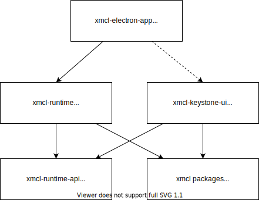

# 기여하기
### 기술 스택 및 배경지식

이 프로젝트의 툴체인 및 런타임 개요는 다음과 같습니다.

전체 프로젝트를 위해 우리는..

- [Node.js >=20](https://nodejs.org/). 핵심 라이브러리 기반 환경.
- [Electron 29](https://electron.atom.io). launcher의 실제 실행 시간.
- [pnpm](https://pnpm.io/). 모노레포 패키지 관리에 사용됨.
- [TypeScript](https://www.typescriptlang.org/). 전체 프로젝트는 가능한 한 많은 TypeScript를 사용합니다.

주 프로세스(Electron)의 경우, 우리는..

- [esbuild](https://esbuild.github.io/). 우리는 메인 프로세스 TypeScript를 빌드하기 위해 esbuild를 사용합니다.

렌더러 측, 즉 순수 프론트엔드 측면에서는

- [Vue](https://vuejs.org). 사용자 인터페이스를 구축하는 데 사용됩니다.
- [Vite](https://vitejs.dev/). 빌드 시스템으로 사용됨.
- [Vuetify](https://vuetifyjs.com/). 구성 요소 저장소로 사용됨.
- [Vue Composition API](https://github.com/vuejs/composition-api). Vue 2용 컴포지셔널 API 브릿지입니다. Vuetify가 Vue 3으로 업그레이드되면 Vue도 업그레이드되어 이 브릿지는 제거될 예정입니다.

### 프로젝트 구조 및 설계



[](https://deepwiki.com/Voxelum/x-minecraft-launcher) 상세 설계를 위한 것입니다. 90%의 사례를 포함해야 합니다!

## 기여하기

프로젝트를 열 때 VSCode 사용을 적극 권장합니다.

### 시작하기

#### 복사하기

`--recurse-submodules` 서브모듈 플래그를 사용하여 프로젝트를 복제하세요.

```bash
git clone --recurse-submodules https://github.com/Voxelum/x-minecraft-launcher
```

`--recurse-submodules` 플래그를 추가하는 것을 잊으셨다면, Git 서브모듈을 수동으로 초기화하고 업데이트해야 합니다.

```bash
git submodule init
git submodule update
```

#### 설치

[pnpm](https://pnpm.io)을 이용하여 설치하세요:

```
pnpm install
```

<details>
  <summary> 중국 내 설치 의존성(예: Electron)이 너무 느린 문제를 해결하는 방법 </summary>

  git bash를 열고 `pnpm i` 앞에 `registry=https://registry.npm.taobao.org electron_mirror="https://npm.taobao.org/mirrors/electron/"`를 추가하세요. 국내 알리바바에서 제공하는 npm 및 Electron 미러를 사용합니다.

  최종적으로 입력된 명령어는 바로

  ```bash
  registry=https://registry.npm.taobao.org electron_mirror="https://npm.taobao.org/mirrors/electron/" pnpm i
  ```
</details>

#### 환경 변수 설정

`xmcl-electron-app` 디렉터리 아래에 `.env` 파일을 생성하여 `CURSEFORGE_API_KEY`를 설정해야 합니다. 이 `.env` 파일은 `.gitignore` 파일에 추가됩니다.

:::warning 기억해두기
**CURSEFORGE API 키를 절대 유출하지 마십시오**
:::

#### 런처 시작

다음 방법들로 런처를 실행할 수 있습니다

#### VSCode

`실행 및 디버그` 섹션으로 이동하여 프로파일 `Electron: Main (launch)`를 사용하여 Electron을 시작합니다. (단축키 F5)

#### VSCode가 아닌 경우

터미널(cmd) 열기

```bash
# UI용 개발 서버 시작
npm run dev:renderer
```

다른 터미널(cmd) 열기

``` bash
# 주 프로세스 코드 실행 시작
npm run dev:main
```

#### 코드 “Hot” 변경

코드 변경 사항이 발생했으며, 실행 중인 런처 인스턴스에 해당 변경 사항을 업데이트하고자 합니다.

##### 브라우저 프로세스

Vite는 핫 리로드를 제공하므로 자동으로 업데이트되어야 합니다. 문제가 발생하면 `Ctrl+R`로 브라우저를 새로고침할 수 있습니다.

##### 메인 프로세스용

VSCode로 런처를 실행하는 경우, 코드를 변경한 후 VSCode 디버거의 재로드 버튼을 누를 수 있습니다.

VSCode로 실행하지 않으면 Electron이 종료되고 자동으로 재로드됩니다.

### 런처 코어에서 오류를 발견했습니다

런처 코어는 TypeScript로 작성된 [별도 프로젝트](https://github.com/voxelum/minecraft-launcher-core-node)에 있습니다.

### VSCode 디버거

런처 코어는 TypeScript로 작성된 [별도 프로젝트](https://github.com/voxelum/minecraft-launcher-core-node)에 있습니다.

(렌더러 프로세스는 Chrome 개발자 도구로 디버깅 가능)

현재 두 가지 옵션이 있습니다:

1. Electron: 메인(실행)
2. Electron: 메인(연결)

첫 번째 옵션으로 실행하면 디버거가 인스턴스에 자동 연결됩니다.

관련 문제가 발견되면 해당 프로젝트에 이슈를 생성해 주세요.

### 코드를 커밋하세요

이 프로젝트는 [기존 커밋 방식](https://www.conventionalcommits.org/en/v1.0.0-beta.3/)을 따릅니다. 간단히 말해, 커밋 메시지의 첫 줄은 다음과 같아야 합니다:

```
commit type: commit description
```

사용 가능한 커밋 유형은 다음과 같습니다: `feat`, `fix`, `refactor`, `style`, `docs`, `chore`, `test`.

[이 gist](https://gist.github.com/joshbuchea/6f47e86d2510bce28f8e7f42ae84c716)를 참조하세요:

> feat: (사용자를 위한 신규 기능, 빌드 스크립트용 신규 기능 아님)
>
> fix: (사용자를 위한 버그 수정, 빌드 스크립트 수정 아님)
>
> docs: (문서 변경)
>
> style: (서식 조정, 누락된 세미콜론 등; 생산 코드 변경 없음)
>
> refactor: (생산 코드 리팩토링, 예: 변수 이름 변경)
>
> test: (누락된 테스트 추가, 테스트 리팩토링; 생산 코드 변경 없음)
>
> chore: (grunt 작업 업데이트 등; 생산 코드 변경 없음)

**이 규칙을 따르지 않을 경우 커밋이 거부됩니다.**

### 빌드 방법

현재 런처는 빌드하기 위해 2개의 명령어를 실행해야 합니다.

먼저 프론트엔드 코드를 빌드해야 합니다:

```bash
pnpm build:renderer
```

`xmcl-keystone-ui` 아래의 코드가 변경되지 않았다면, 다시 빌드할 필요가 없습니다.

그런 다음, 방금 빌드한 프론트엔드와 함께 Electron 번들링을 빌드할 수 있습니다:

```bash
pnpm build
```
