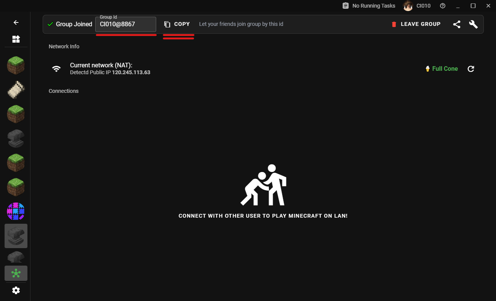
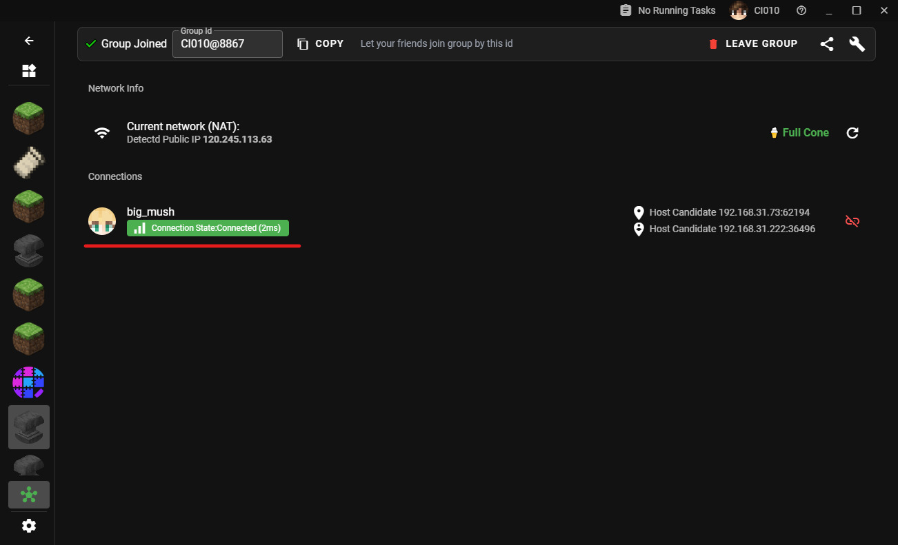
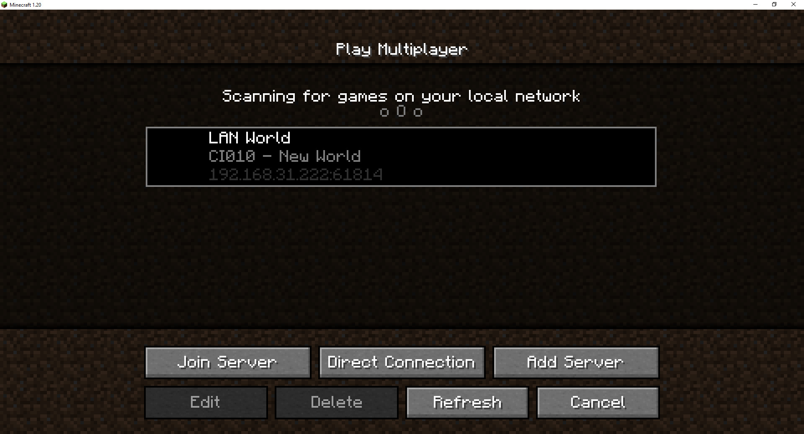

# 멀티플레이어 가이드

> 준비 중

## 시작하기

`LAN 멀티플레이어` 페이지로 이동하세요.

우측 상단의 `그룹 참여/생성` 버튼을 클릭하세요. (우측 상단 + 버튼)

인터넷 연결이 정상적이라면 그룹을 생성할 수 있습니다. 생성 후 `그룹 ID`를 클릭하여 복사하세요.

상대방이 이 `그룹 ID`를 입력하면 그룹에 참여할 수 있어요. 참여가 완료되면 아래에 연결 상태가 표시됩니다.

그 후 게임을 시작하고 LAN에 게임을 열면, 친구는 동일한 LAN에 있지 않아도 게임을 확인할 수 있답니다.

## 포워딩 서비스 사용 방법

> 준비 중

## 오프라인 스킨

> 준비 중

