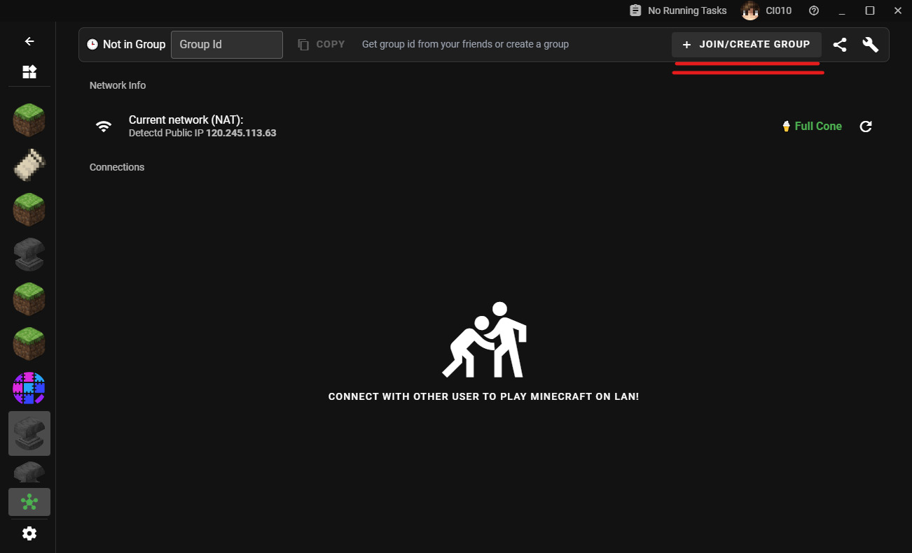

# Multiplayer Guide

> 준비 중

## Quick Start

`Multiplayer On LAN` 페이지로 이동합니다.

우측 상단의 `Join/Create Group` 버튼을 클릭합니다.

인터넷 연결이 정상적이라면 그룹을 생성할 수 있습니다. 생성 후 `Group ID`를 클릭하여 복사합니다.

상대방이 이 `Group ID`를 입력하면 그룹에 참여할 수 있습니다. 참여가 완료되면 아래에 연결 상태가 표시됩니다.

그 후 게임을 시작하고 LAN에 게임을 열면, 친구는 동일한 LAN에 있지 않아도 게임을 확인할 수 있습니다.

## How to use forwarding services

> 준비 중

## Offline Skins

> 준비 중

