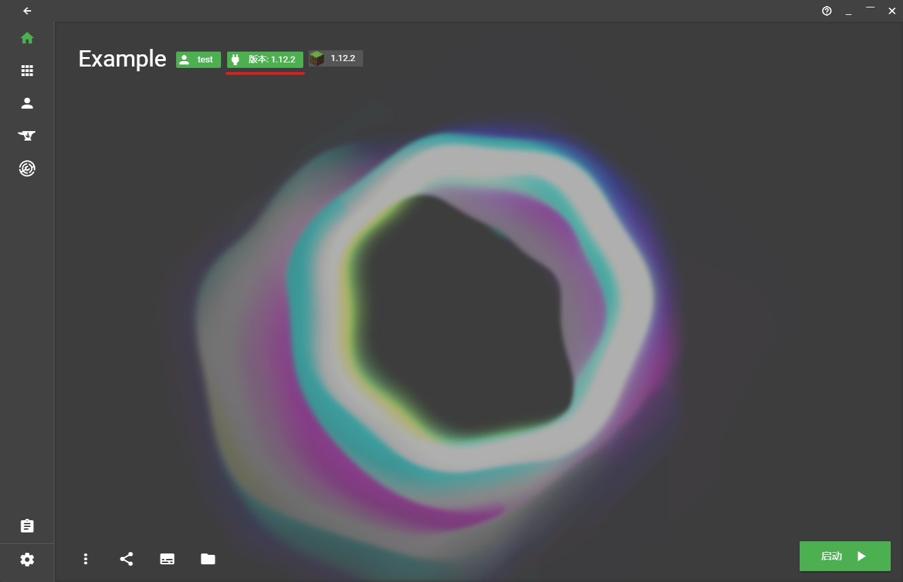

# KeyStone UI 用户手册

本文意在对启动器的功能进行展示说明，并给大家一些基本的概念

## 基本概念

### 实例 Instance （版本隔离？）

实例，即是一组游戏配置，比如一组 Minecraft 版本，Forge 版本，java 版本，内存设置的组合。

一个实例对应着一个**实际的文件夹路径**，启动器选择用某个实例启动后，Minecraft 会在对应文件夹下生成 logs，游戏设置（options.txt）文件等。

XMCL是一个基于实例的启动器，你简单的创建、修改、删除实例。有些启动器叫这个功能**版本隔离**，但做的事情实际上大同小异。

对于一个实例一个文件夹，最大的好处还是玩家的 Mods 可以分开管理了。Mod 管理详情见 [Mod 管理](#) 部分。

### 资源 Resource

目前资源在XMCL中指代了所有导入的

- 资源包
- 光影包
- Mod（模组）
- 整合包
- 地图

他们有统一的管理格式，启动器在导入时会辨别这些资源的元数据并加以利用，这样你就可以在启动器中看到 Mod 的具体信息了（如 modid、版本等）

### 版本 Version

版本就是玩家正常理解的 Minecraft 游戏版本，他们被存储在 `versions/<version-id>/<version-id>.json` 文件中。启动器在打开之初读取本地的这些版本信息。

## 安装游戏

用户首先需要进入版本设置，在首页中点击当前版本的标志：

## 实例管理

实例管理

## 资源

## Mod 管理

## 从 Curseforge 安装资源

##