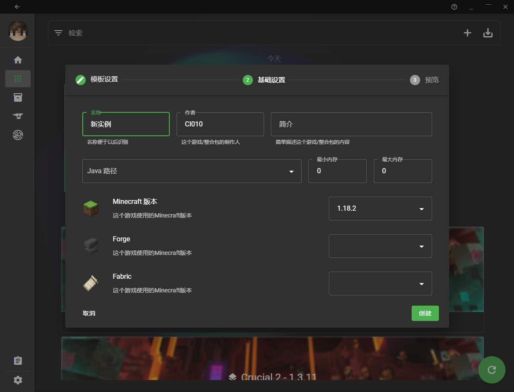
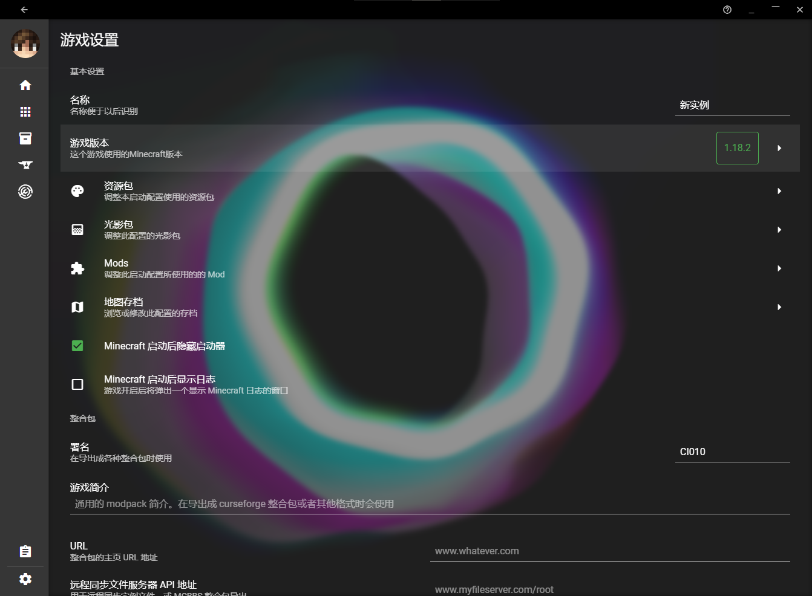

# KeyStone UI 常见问题 FAQ

## [版本隔离？不，XMCL中使用的是实例 (Instance)](#版本隔离不xmcl中使用的是实例)

大家熟悉的一些启动器，是使用`版本隔离`实现不同启动目标之间的数据隔离的

<VanillaProjectTree />

XMCL 是通过 `实例隔离` 来实现不同启动目标的数据隔离的，这点和 multimc 启动器，或 ftb 启动器更像

<XMCLProjectTree />

你可能对上述结构有所疑问，`versions` 呢？`libraries` 呢？不要急，那些都被存储在一个公用的数据文件夹下（就是启动器一开始让你选择的那个）

<CentraProjectTree />

这样的设计首先有一个显而易见的的好处: **空间效率较高**。重复的 mod、资源包等不会站额外空间。

那有什么**坏处**？可能是实例的文件夹不好直接复制来分享给别人了，但不用担心，启动器内置生成整合包功能。

*~~可能对一部分人的坏处就是学习成本~~*

## [到底如何使用实例呢?](#到底如何使用实例呢)

### [找到选择实例界面](找到选择实例界面)

话不多说，直接上图

首先在侧边栏点击 `选择实例` 按钮。

你会看到如上图页面，这个界面就是管理实例的界面。其中 `HHH` 是刚才在主页看到的实例名字，而图中也有其他的实例。你会注意到每个实例的`游戏版本`都不一样。回忆上个章节讲的，每个实例的文件夹都相互是**独立的**。这意味着 `mods`, `config`, `options.txt` 等文件的独立存在。

### [添加新实例](添加新实例)

你需要点击上方的 + 加号添加一个新的实例来实现`实例(版本)隔离`。

这里你会看到一些配置创建实例的基本选项，*这些选项在创建后都可以调整*。

点击创建，你就会自动进入到`新实例`中了。

### [调整实例启动选项](#调整实例启动选项)

在主页，点击左下角三个点（更多）按钮

你会进入实例的基本设置页。

在这个页面上方，可以进入版本页面调整这个实例的`游戏版本`。这个页面中向下滑动，你可以调整 `java 路径`，`JAVA 内存`，`JVM/Minecraft 额外参数`等。

如果你想进入实例的文件夹，去更改如<code>options.txt</code>等，点击主页下方的 <i class="ui folder large icon text-white mx-1-2" /> 按钮

## [XMCL 和 PCL2, HMCL 比怎么样](#compare)

由于经常有人问这个问题，我认为在这里明确对比 PCL2 和 HMCL 是有必要的

|                    | XMCL                                                                                                 | PCL2                                | HMCL                                                                                                   |
| ------------------ | ---------------------------------------------------------------------------------------------------- | ----------------------------------- | ------------------------------------------------------------------------------------------------------ |
| 如何实现多启动目标 | ✔️ 实例隔离                                                                                           | ✔️ 版本隔离                          | ✔️ 版本隔离                                                                                             |
| 跨平台             | <i class="windows icon"></i>Windows, <i class="apple icon"></i>Mac, <i class="ubuntu icon"></i>Linux | <i class="windows icon"></i>Windows | <i class="windows icon"></i>Windows, <i class="apple icon"></i>Mac, <i class="ubuntu icon"></i>Linux |
| 启动器依赖         | ✔️ 无依赖                                                                                             | ⚠️ 需要用户有 .net                   | ⚠️ 需要用户有 java                                                                                      |
| 启动器大小         | ⭕ 很大，压缩后~80mb左右                                                                              | ✔️ 很小，不算依赖<5mb                | ✔️ 很小，不算依赖<5mb                                                                                   |
| Mod 管理           | ✅ 集中式管理，使用硬链接管理到每个实例                                                               | ✔️ 支持安装到每个版本                | ✔️ 支持安装到每个版本                                                                                   |
| 资源包管理         | ✅ 集中式管理，使用软连接管理到每个实例                                                               | ✔️ 通过整合包支持?安装到每个版本     | ✔️ 通过整合包支持?安装到每个版本                                                                        |
| 光影包管理         | ✅ 集中式管理，使用软连接管理到每个实例                                                               | ⭕ 无                                | ⭕ 无                                                                                                   |
| 拓展性             | ✅ 强，基于 web 技术，可以做到启动器**完全**换皮                                                      | ✔️ 支持 XAML 自定义主界面            | ❔ 支持设置中调整 UI                                                                                    |
| Curseforge         | ✔️ 支持，但暂时没有翻译                                                                               | ✅ 支持，并使用自己的中文 api        | ✅ 支持                                                                                                 |
| Modrinth           | ✔️ 支持                                                                                               | ⭕ 无                                | ⭕ 无                                                                                                   |
| 导出整合包         | ✔️ 支持 MCBBS，Curseforge                                                                             | ❔ 好像不支持？                      | ✔️ 支持 MCBBS，Curseforge                                                                               |

如果你需要管理大量 `Mods`，`资源包`，`光影包`等，XMCL 毋庸置疑比 PCL2 和 HMCL 好。
但缺点就是 XMCL 体积庞大，有些功能对于一部分用户来说也是**臃肿**的。

## [怎么删除实例、Mod、账户等](#怎么删除实例mod账户等)

启动器内的卡片大多能拖动，请尝试拖动卡片，然后把卡片拽到出现的垃圾桶按钮上删除。

对于删除 `Mod`, `资源包` 这种情况，你也可以直接进入实例文件夹中直接删除文件，启动器会自动同步。
