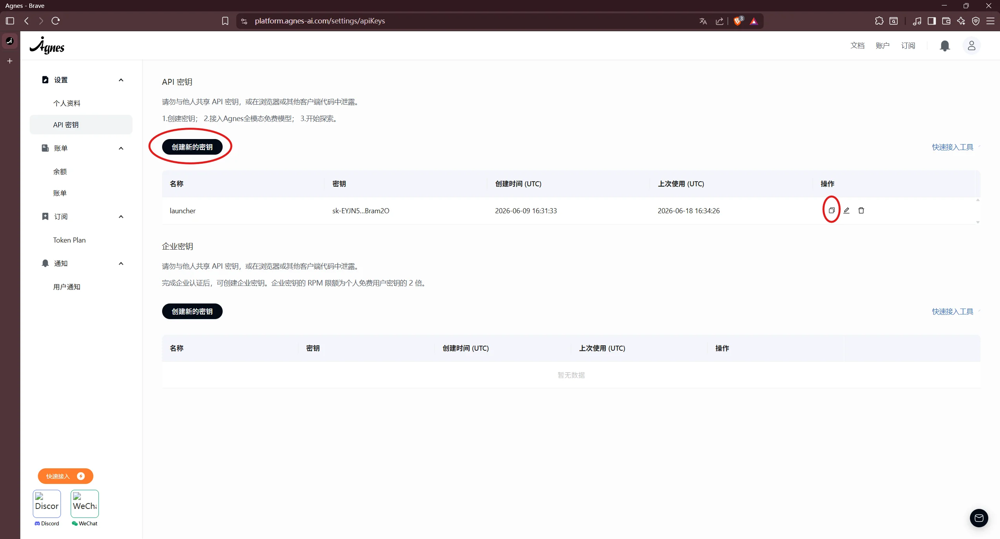

# Настройка Agnes AI

Это руководство поможет настроить встроенный AI Agent в XMCL.

После настройки вы сможете:

- открывать окно AI Agent;
- разбирать краш-логи встроенным агентом;
- использовать инструменты агента (включение/выключение модов, установка, поиск/правка конфигов и т.д.).

## Что понадобится

- Актуальная версия XMCL.
- Доступ в интернет.
- API-ключ Agnes AI.

## Шаг 1: Получите API-ключ Agnes AI

1. Откройте портал разработчика Agnes AI.
2. Войдите в аккаунт или зарегистрируйтесь.
3. Создайте API-ключ.
4. Скопируйте и сохраните ключ в безопасном месте.



## Шаг 2: Откройте настройки Agent в XMCL

1. Откройте XMCL.
2. Перейдите в **Settings -> General**.
3. Включите **Developer Mode**.
4. Прокрутите до секции **AI Agent**.


## Шаг 3: Заполните поля Agent

В секции **AI Agent**:

- **API Key**: вставьте ключ Agnes;
- **Model**: оставьте по умолчанию, если нет иных требований;
- **Endpoint**: оставьте по умолчанию, если нет иных требований.

Стандартный endpoint Agnes:

```text
https://apihub.agnes-ai.com/v1/chat/completions
```


## Шаг 4: Проверьте, что всё работает

1. Нажмите `Ctrl/Cmd + Shift + A`, чтобы открыть окно Agent.
2. Отправьте простую команду, например: `list my installed mods`.
3. Убедитесь, что агент отвечает без ошибки конфигурации.

## Устранение проблем

### Agent не открывается

- Проверьте, что включен **Developer Mode**.
- После включения Developer Mode перезапустите XMCL.

### Всё ещё показывается предупреждение "не настроено"

- Проверьте API-ключ (без лишних пробелов/переводов строки).
- Убедитесь, что endpoint доступен из вашей сети.

### Ошибка запроса / 401 / 403

- Ключ недействителен, просрочен или не имеет прав.
- Сгенерируйте новый ключ в портале Agnes и вставьте снова.

### Таймаут запроса

- Проверьте фаервол/прокси.
- Попробуйте снова со стандартным endpoint.

## Безопасность

- Относитесь к API-ключу как к паролю.
- Не публикуйте скриншоты, где виден ключ.
- При подозрении на утечку немедленно смените ключ.
