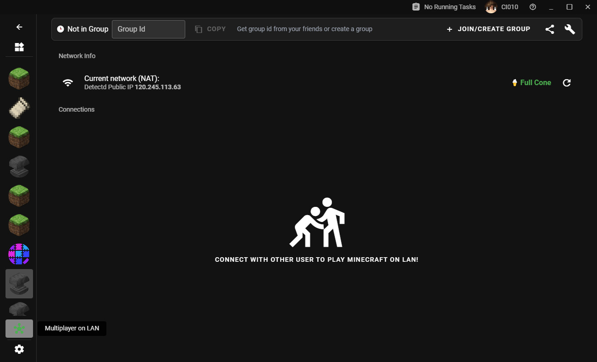
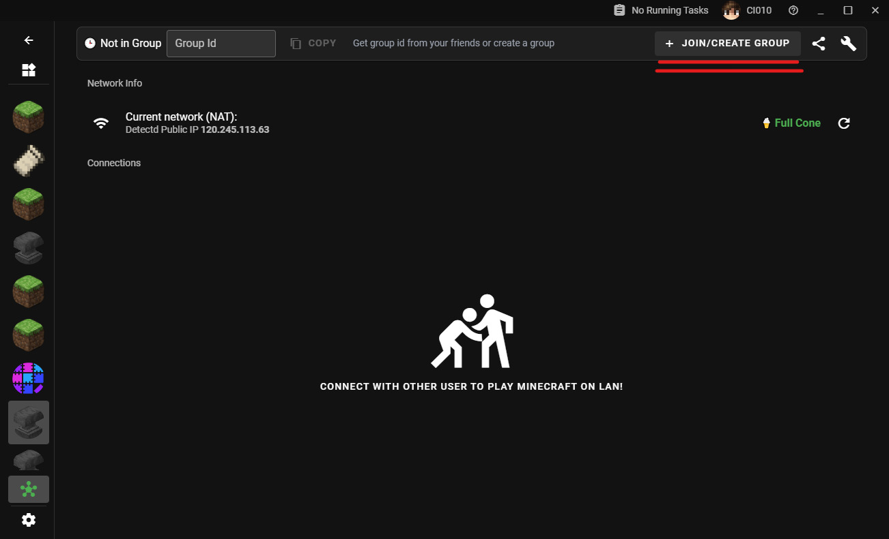
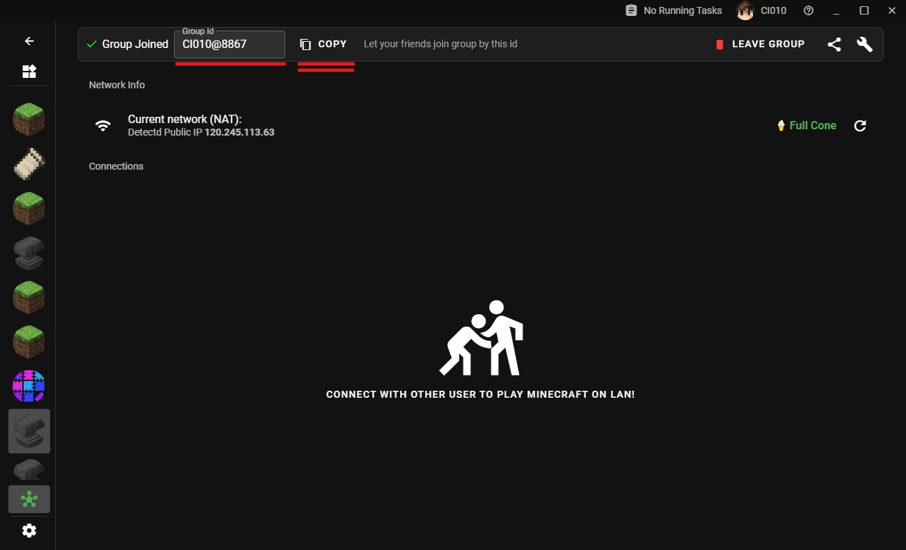
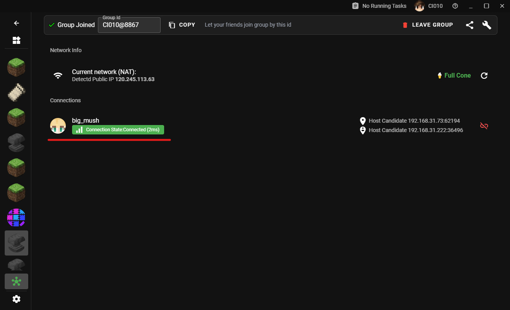
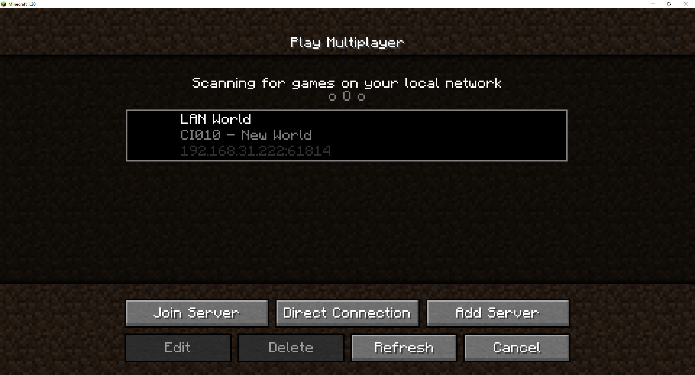

# Многопользовательская игра

## Быстрый старт

Перейдите на страницу `Игра по локальной сети`.

Нажмите кнопку `Присоединиться/создать группу` в правом верхнем углу.

Вам следует создать группу, если у вас хорошее интернет-соединение. Нажмите на `ID группы`, чтобы скопировать его.

Ваш партнер должен ввести этот `ID группы`, чтобы присоединиться к вашей группе. Как только он присоединится, вы увидите его / ее статус подключенного ниже.

Затем вам следует запустить игру и открыть ее в локальной сети, и ваш друг должен увидеть вашу игру, даже если вы находитесь в другой локальной сети.

## Как использовать сервисы ретрансляторы

> В разработке....

## Оффлайн скины

> В разработке....
