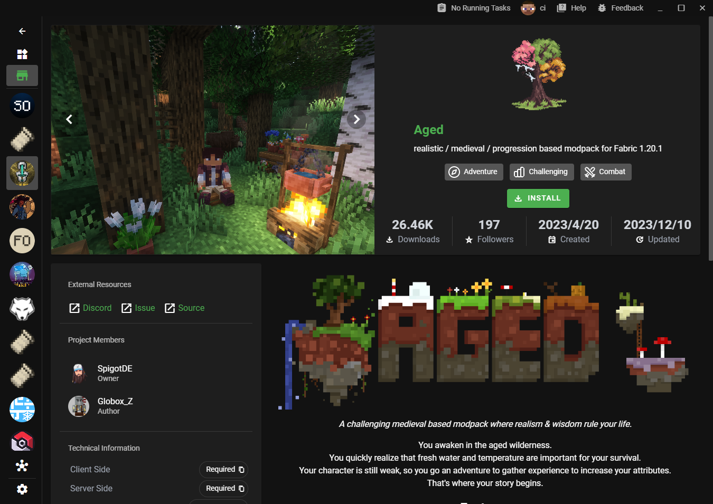

## [0.39.0](#0.39.0)
### 🚀 新特性

- [为模组包添加新的商店页面](#为模组包添加新的商店页面) ([0abc2609137a155183a13d7bd7064feaa1d170cf](https://github.com/Voxelum/x-minecraft-launcher/commit/0abc2609137a155183a13d7bd7064feaa1d170cf))
- 支持 Oculus 作为着色器模组 ([9b06fca5b5b3c409a6409032cab81a4160dbf3e1](https://github.com/Voxelum/x-minecraft-launcher/commit/9b06fca5b5b3c409a6409032cab81a4160dbf3e1))
- 现在支持德语 (#542) ([25146f91c8deb1b8827e8c9755e0b04f760daaa8](https://github.com/Voxelum/x-minecraft-launcher/commit/25146f91c8deb1b8827e8c9755e0b04

### 🐛 修复与补丁

- 有时 CurseForge 详情无法显示 ([fec80602929338e5b613321bce699e0c2c797192](https://github.com/Voxelum/x-minecraft-launcher/commit/fec80602929338e5b613321bce699e0c2c797192))
- 用户应能够中止预启动任务 ([09cd1fd0befc389b0c24a0eb33733e9ae6efcebd](https://github.com/Voxelum/x-minecraft-launcher/commit/09cd1fd0befc389b0c24a0eb33733e9ae6efcebd))
- 由于模组包失败，不应阻止实例安装 ([c3d8b5555d811209e8fa385ab485cbfd7b3edb7f](https://github.com/Voxelum/x-minecraft-launcher/commit/c3d8b5555d811209e8fa385ab485cbfd7b3edb7f))
- 尝试捕获不良 Xbox 帐户问题 ([4a04c3d618694393e2d16be7d36071ae60b3323c](https://github.com/Voxelum/x-minecraft-launcher/commit/4a04c3d618694393e2d16be7d36071ae60b3323c))

### 🏗️ 重构

- 调整新闻时间格式 ([4363ca010c469ada937205856138fc304054a8a3](https://github.com/Voxelum/x-minecraft-launcher/commit/4363ca010c469ada937205856138fc304054a8a3))
- 跟踪启动性能 ([3faa99a410c883a0da1a546773eaec9b3db0a997](https://github.com/Voxelum/x-minecraft-launcher/commit/3faa99a410c883a0da1a546773eaec9b3db0a997))
- 在新版本的 Electron 中移除解压工作文件 ([432c8c545d331fd74c1a9db70773da250e9a134d](https://github.com/Voxelum/x-minecraft-launcher/commit/432c8c545d331fd74c1a9db70773da250e9a134d))
- 处理更多错误 ([7f0f48852c6b238d2e6831e3e646954dd3aa903b](https://github.com/Voxelum/x-minecraft-launcher/commit/7f0f48852c6b238d2e6831e3e646954dd3aa903b))
- 改善导入性能 ([8d22984583128f82a90427ea604d6a2128a3a2ce](https://github.com/Voxelum/x-minecraft-launcher/commit/8d22984583128f82a90427ea604d6a2128a3a2ce))
- 移除未使用的国际化键 ([9f8a18ad9b54e7dbeb5aa12f08c9d265073d9abc](https://github.com/Voxelum/x-minecraft-launcher/commit/9f8a18ad9b54e7dbeb5aa12f08c9d265073d9abc))
- 将本地资源分组 ([db2d482eb4df572faf4cdea832315c86b2024a89](https://github.com/Voxelum/x-minecraft-launcher/commit/db2d482eb4df572faf4cdea832315c86b2024a89))
- 使用会话 ID 作为对等组 ID ([261623e4a35c9651de42ef0dee24e1a29c5deef1](https://github.com/Voxelum/x-minecraft-launcher/commit/261623e4a35c9651de42ef0dee24e1a29c5deef1))

## 为模组包添加新的商店页面

新功能更新将专注于为模组包添加统一的商店页面，提供“一键游玩”模组包体验。

未安装的模组包将显示“安装”按钮。点击安装将直接下载并创建相应的实例（无需对话框）。

已安装的模组包将显示“Play”按钮，点击将重定向到相关的实例页面。

最终的安装/游玩模组包的体验和逻辑应该类似于在 Steam 中安装/游玩游戏。
